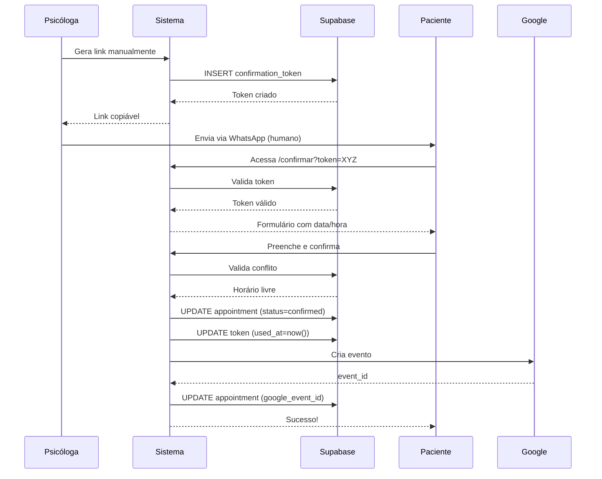
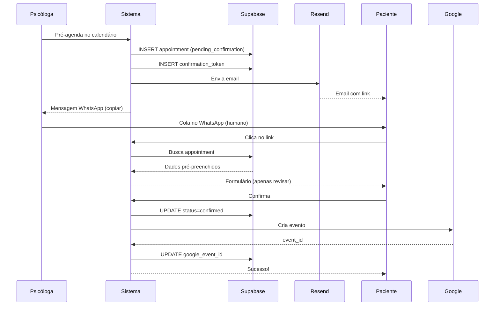

# 🏗️ Arquitetura do PsiManager

## Visão Geral

O PsiManager segue uma arquitetura **serverless** com separação clara entre frontend e backend.
```
┌──────────────────────────────────────────────┐
│            CAMADA DE APRESENTAÇÃO            │
│         React + TypeScript + Vite            │
│                                              │
│  ┌────────────┐  ┌─────────────┐            │
│  │   Views    │  │ Components  │            │
│  │  (Pages)   │  │   (UI/UX)   │            │
│  └─────┬──────┘  └──────┬──────┘            │
│        │                │                    │
│        └────────┬───────┘                    │
│                 │                            │
│         ┌───────▼────────┐                   │
│         │    Services    │                   │
│         │  (Business)    │                   │
│         └───────┬────────┘                   │
└─────────────────┼──────────────────────────┘
                  │
                  │ HTTP/WebSocket
                  │
┌─────────────────▼──────────────────────────┐
│           CAMADA DE BACKEND                 │
│        Supabase (Postgres + RLS)            │
│                                              │
│  ┌──────────────┐  ┌──────────────┐        │
│  │  Edge        │  │  Real-time   │        │
│  │  Functions   │  │  Subscriptions│        │
│  │  (Deno)      │  │  (WebSocket) │        │
│  └──────┬───────┘  └──────┬───────┘        │
│         │                 │                 │
│         └────────┬────────┘                 │
│                  │                          │
│         ┌────────▼────────┐                 │
│         │   PostgreSQL    │                 │
│         │   + RLS         │                 │
│         └────────┬────────┘                 │
└──────────────────┼─────────────────────────┘
                   │
                   │ API calls
                   │
┌──────────────────▼─────────────────────────┐
│        INTEGRAÇÕES EXTERNAS                 │
│                                              │
│  ┌─────────────┐  ┌──────────────┐         │
│  │   Google    │  │    Resend    │         │
│  │  Calendar   │  │   (Email)    │         │
│  │    API      │  │              │         │
│  └─────────────┘  └──────────────┘         │
└──────────────────────────────────────────────┘
```

---

## Componentes Principais

### 1. Motor Central de Agendamento

**Arquivo:** `services/features/appointments/appointment-engine.service.ts`

**Responsabilidades:**
- Validação de disponibilidade
- Criação de agendamentos
- Confirmação via token
- Geração de tokens seguros
- Coordenação de estados

**Fluxo de Validação:**
```typescript
validateAvailability()
  ├─> Query appointments na data/hora
  ├─> Verificar status != 'cancelled'
  ├─> Excluir appointment_id se fornecido
  └─> Retornar { valid: boolean, conflicts?: [] }
```

**Garantias:**
✅ Thread-safe (validação no banco)
✅ Atômico (transaction implícita)
✅ Idempotente (token uso único)

---

### 2. Sistema de Tokens

**Tabela:** `confirmation_tokens`

**Schema:**
```sql
id: uuid (PK)
appointment_id: uuid (FK → appointments)
token: text (UNIQUE)
expires_at: timestamptz (now() + 24h)
used_at: timestamptz (NULL até uso)
created_at: timestamptz
```

**Lifecycle:**
```
1. Token gerado (crypto.randomUUID())
   ↓
2. expires_at = now() + 24h
   ↓
3. Link enviado ao paciente
   ↓
4. Paciente confirma
   ↓
5. used_at = now()
   ↓
6. Token invalidado (não reutilizável)
```

**Segurança:**
- Token UUID v4 (128-bit entropia)
- Expiração server-side validada
- Uso único garantido por flag
- Cleanup automático (cron job opcional)

---

### 3. Sincronização Google Calendar

**Service:** `services/integrations/google-calendar.service.ts`

**Edge Functions:**
- `google-calendar-create` - Cria evento (RRULE suportado)
- `google-calendar-update` - Atualiza data/hora
- `google-calendar-cancel` - Remove evento
- `google-calendar-health` - Valida configuração

**Autenticação:**
```
Service Account (OAuth 2.0)
  ├─> JSON Key com private_key
  ├─> Scope: calendar
  └─> JWT auto-signed
```

**RRULE Support:**
```typescript
// Semanal:
RRULE:FREQ=WEEKLY

// Quinzenal:
RRULE:FREQ=WEEKLY;INTERVAL=2

// Mensal:
RRULE:FREQ=MONTHLY

// Com data final:
RRULE:FREQ=WEEKLY;UNTIL=20260501T235959Z
```

**Sincronização Bidirecional:**
```
Hook: useAppointmentSync
  ├─> Escuta postgres_changes
  ├─> Detecta INSERT/UPDATE/DELETE
  ├─> Chama Edge Function apropriada
  └─> Atualiza google_event_id no banco
```

---

### 4. Real-time Subscriptions

**Hook:** `useAppointmentSync.ts`

**Funcionamento:**
```typescript
// 1. Criar canal
const channel = supabase.channel('appointments-sync')

// 2. Escutar mudanças
.on('postgres_changes', {
  event: '*',
  schema: 'public',
  table: 'appointments'
}, (payload) => {
  // 3. Processar evento
  syncWithGoogleCalendar(payload)
})

// 4. Subscribe
.subscribe()
```

**Eventos Tratados:**
| Evento | Ação |
|--------|------|
| INSERT + status=confirmed | Criar evento no Google |
| UPDATE + data/hora mudou | Atualizar evento |
| UPDATE + status=cancelled | Cancelar evento |
| DELETE | Remover evento |

---

### 5. Email Transacional

**Provider:** Resend
**Edge Function:** `send-confirmation-email`

**Template HTML:**
```html
<!DOCTYPE html>
<html>
  <head>
    <style>
      /* Inline CSS (compatibilidade email clients) */
      .button {
        background: #10b981;
        color: white;
        padding: 16px 32px;
        border-radius: 8px;
        text-decoration: none;
      }
    </style>
  </head>
  <body>
    <h1>Olá, {{name}}!</h1>
    <p>Confirme seu agendamento:</p>
    <p><strong>📅 Data:</strong> {{formatted_date}}</p>
    <p><strong>🕐 Horário:</strong> {{time}}</p>
    <a href="{{link}}" class="button">Confirmar Agendamento</a>
  </body>
</html>
```

**Fallback:**
Link alternativo em texto plano caso botão não renderize.

---

## Fluxo de Dados Detalhado

### Fluxo A: Paciente Inicia


### Fluxo B: Psicóloga Inicia


---

## Decisões Arquiteturais

### Por que Supabase?

✅ **Postgres robusto** - Transações ACID
✅ **RLS nativo** - Segurança row-level
✅ **Real-time built-in** - WebSocket sem config
✅ **Edge Functions** - Deno serverless
✅ **Free tier generoso** - MVP sem custo

### Por que Edge Functions (Deno)?

✅ **TypeScript nativo** - Sem transpilação
✅ **Deploy instantâneo** - Git push = live
✅ **Auto-scaling** - Suporta picos
✅ **Imports de URL** - Sem node_modules
✅ **Isolamento** - Segurança por design

### Por que NÃO Twilio?

❌ **Custo** - $0.0079 por mensagem
❌ **Dependência externa crítica**
❌ **Complexidade** - Webhooks, retry, queues
❌ **Sandbox limitado** - Produção cara

✅ **Alternativa:** WhatsApp humano + copiar/colar
- Zero custo
- Total controle
- Mesma UX final

### Por que Service Account (não OAuth)?

✅ **Server-to-server** - Sem fluxo de usuário
✅ **Sem refresh tokens** - JWT auto-assinado
✅ **Controle total** - Revogação centralizada
✅ **Melhor DX** - Setup one-time

---

## Padrões de Código

### Nomenclatura
```typescript
// Services: PascalCase + "Service"
export class AppointmentEngineService {}

// Functions: camelCase + verbo
async function createAppointment() {}

// Interfaces: PascalCase
interface AppointmentData {}

// Types: PascalCase + "Type"
type RecurrenceType = 'single' | 'weekly'

// Constants: UPPER_SNAKE_CASE
const MAX_RETRIES = 3
```

---

## Segurança

### Camadas de Proteção
```
1. CORS
   ├─> Edge Functions restringem origens
   └─> Apenas frontend autorizado

2. RLS (Row Level Security)
   ├─> Policies baseadas em auth.uid()
   └─> Isolamento total de dados

3. Tokens
   ├─> UUID v4 (não sequencial)
   ├─> Expiração server-side
   └─> Uso único garantido

4. HTTPS
   ├─> TLS 1.3 (Supabase + Vercel)
   └─> Certificados auto-renovados

5. Secrets
   ├─> Supabase Vault (encrypted)
   └─> Nunca em código-fonte
```

---

**Documento mantido por:** Alex1mk  
**Última atualização:** {{CURRENT_DATE}}  
**Versão:** 2.0.0
